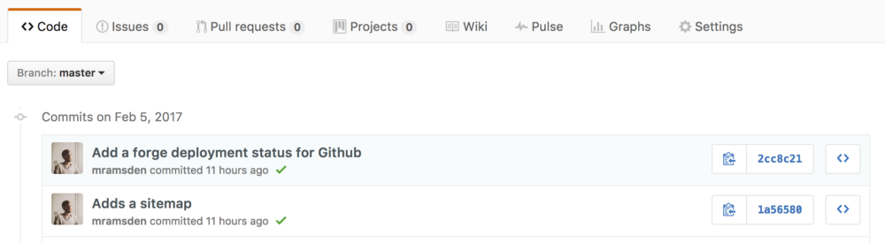

[Laravel Forge](https://forge.laravel.com/) is a great way of managing the setup of your servers for your PHP projects. It takes care of ensuring that all the appropriate dependencies are setup on your server as well. In this post we’ll look at how to notify Github following a successful push based deployment.

First off let’s look at the deployment script. I like to keep as much of my deployment process checked into version control as possible as it’s an artifact of building an application.

```shell
#!/bin/bash

function deploy() {
    composer install --no-interaction --prefer-dist --optimize-autoloader && 
    yarn install && 
    npm run production ||
    return $?
}

function update_github_status() {
    repo=$1
    git_sha=$2
    status=$3
    curl -X POST "https://api.github.com/repos/$repo/statuses/$git_sha" -d "{\"state\":\"$status\",\"description\":\"Forge Deployment\",\"context\":\"forge\"}" -H "Content-Type: application/json" -H "Accept: application/vnd.github.v3+json" -H "Authorization: token $GITHUB_TOKEN"
}

repo="username/repository"
git_sha=`git rev-parse HEAD`

update_github_status $repo $git_sha pending
deploy
if [ $? -eq 0 ]; then
    update_github_status $repo $git_sha success
else
    update_github_status $repo $git_sha failed
fi
```

The `deploy` function takes care of running the actual deployment steps on the server. In this case it installs all PHP and Node dependencies then runs the npm script build. The final return line will return the status code of running those commands. If it’s non-zero then something failed during the deployment.

The `update_github_status` function will use the [Github Status API](https://developer.github.com/v3/repos/statuses/) to update your commits in Github with the status of the deployment.

In the final block of the script the deployment process is run. First the name of the repository to update and the git version identifier are set. Next the commit status is updated to “pending” and the deployment started. Once the deployment is started the last return code is checked and if the code is 0 then the commit status is updated to “success” otherwise it’s updated to “failed”.

Now to connect everything up to Forge the Deploy Script for the site needs to be updated to the following:

```shell
cd /home/forge/default
git pull origin master

GITHUB_TOKEN=<Your Github Token> bin/forge-deploy
```

You can retrieve a Github authorization token for your project by going [here](https://github.com/settings/tokens/new). You will need to create a token with the **repo:status** scope. You should create a token with the minimum required scope so that your Github account is protected if your token is stolen.

Once this is done after a Forge deployment you will see the status indicators appearing on the commits in your Github repo:



An orange dot means pending, a green tick means success and a red cross means failed.
